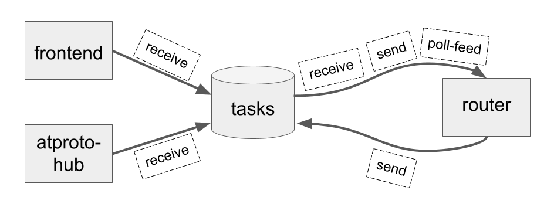

# Bridgy Fed technical design

<style type="text/css">
.right {
    float: right;
}

@media screen and (max-width: 455px) {
	.right {width: 100%;}
}
@media screen and (min-width: 456px) {
	.right { width: 45%; margin-left: 1em; }
}
</style>

<a href="../_static/octopus_attacks_ship.jpg">
  </a>

So you want to hack on Bridgy Fed, or see how it's built on the inside? Welcome! You've come to the right place.

```{contents}
:depth: 3
```

# Introduction

<a href="../_static/diagram-overview.png">
  </a>

At its core, Bridgy Fed is a middleman. It doesn't provide its own social network, protocol, data format, or anything else. It's just a proxy that translates between existing social networking protocols, currently [IndieWeb](https://indieweb.org/), [ActivityPub](https://activitypub.rocks/), and [AT Protocol](https://atproto.com/). It receives events and activities, translates them from one protocol to the others, and sends them back out.

That sounds simple, but [protocols are complicated](https://fed.brid.gy/docs#compare), as is [translating between them](https://fed.brid.gy/docs#router). If there's one key to understanding Bridgy Fed, it's this: Bridgy Fed *abstracts* across protocols. We implement each protocol, but we try hard to keep the rest of our logic and code as *generic* as possible. When we get an incoming activity, we immediately convert it to a common internal format, operate on that, and only translate it out of that internal format when we're ready to send it back out.

That's it. That's the only real special sauce, and it's not even that special.

Still here? OK! On with the show...


# Architecture

At a high level, Bridgy Fed consists of three services and a task queue. The services don't interact directly; they interact via tasks that are enqueued and run asynchronously.



## Services

* `frontend` (aka `default`) is the external-facing frontend that serves most HTTP requests from the internet. This includes the [fed.brid.gy](https://fed.brid.gy/) web site, Webfinger, ActivityPub actors and inboxes and collections, the `/convert/...` endpoint that converts objects between protocols and data formats, most [AT Protocol XRPC methods](https://atproto.com/specs/xrpc), and more.
* `router` is the [activity router](https://fed.brid.gy/docs#router). It receives events and activities from each protocol, handles them, and sends them back out to other protocols. These are all tasks sent to it by the task queue as HTTP requests.
* `atproto-hub` is a special, single-instance service that connects to and processes the [Bluesky firehose](https://docs.bsky.app/docs/advanced-guides/firehose), and also serves its own firehose (via the `com.atproto.sync.subscribeRepos` XRPC method) to subscribers like the Bluesky relay. These are all long-lived WebSocket connections, so this service is manually scaled and only runs on a single instance.

`frontend` and `atproto-hub` are somewhat latency sensitive. `frontend` serves external HTTP requests, which we always want to be relatively low latency. `atproto-hub` is a single runtime, on a single instance, and our firehose subscriber in particular has to be a single thread, since it consumes the firehose over a single WebSocket connection. `frontend` and `atproto-hub` both handle incoming requests and events synchronously, so they need to scale with incoming traffic and firehose volume.

So, we try to move work off of these services as quickly as possible and onto the task queue, which lets us buffer and process that load more evenly over time. This includes most of our heavier operations, eg external network requests, and scaling, eg fan-out for ActivityPub delivery for accounts with many followers. We try to do these in the background, via tasks run by the `router` service, as much as possible. (Most fediverse servers are designed the same way.)

The three main task queues are:

* `receive`: incoming events and activities that we've received and need to handle and route
* `send`: activities that we're ready to send out to individual targets, ie a specific server or URL over a specific protocol
* `poll-feed`: recurring tasks to poll web sites' RSS and Atom feeds


## Hosting

Bridgy Fed runs on Google Cloud. The key services it uses are:

* [App Engine](https://cloud.google.com/appengine/) for serving and compute
* [Datastore](https://cloud.google.com/datastore/) as the database
* [Tasks](https://cloud.google.com/tasks/) to enqueue and trigger background tasks
* [DNS](https://cloud.google.com/dns/) for `brid.gy` and all subdomains, so that it can automatically create the multi-level `_atproto` TXT records for [AT Protocol handles](https://atproto.com/specs/handle#handle-resolution)

Google Cloud is priced competitively with the other hyperscalers and major cloud providers, [but it's not cheap](https://github.com/snarfed/bridgy-fed/issues/1149). As of Jan 2025, we spend roughly $.02 per user per month, $.0015 per bridged activity. We could find cheaper raw compute and storage elsewhere, but we wouldn't get any of the other GCP services that we use, or the high end hardware ops, devops/SREs, security, etc. We could do all of that ourselves, with open source tools, but we wouldn't do them nearly as well, and they would take a lot of time away from developing Bridgy Fed itself. (There's also lock-in - migrating would be a big project - but that's a lesser concern.)


# Data model

Bridgy Fed runs on Google Cloud and stores data in [Google Cloud Datastore](https://cloud.google.com/datastore/). (Ok, technically Firestore in Datastore mode.) It's a NoSQL database, but you can think of it more or less like a relational database, just bigger and dumber.

We use [ndb](https://googleapis.dev/python/python-ndb/latest/) as our ORM. It's a venerable, conventional ORM for Datastore. Every table is defined by a Python class that ultimately derives from [`ndb.Model`](https://googleapis.dev/python/python-ndb/latest/model.html), with properties (columns) defined via [type-specific ndb `Property` classes](https://googleapis.dev/python/python-ndb/latest/model.html). Queries are programmatic, not SQL.

Common models in Bridgy Fed are defined in [](models). Each protocol has its own separate source file where its user model class is defined, eg [](Web) is in [](web).


## Users

Bridgy Fed has two core sets of tables ("kinds"): _users_ and _objects_. For users, each protocol has its own table, eg [](Web), [](ActivityPub), and [](ATProto). Every user who interacts with Bridgy Fed gets a row ("entity") in the corresponding table. Many users in these tables have opted into Bridgy Fed and enabled the bridge, but not all.

Each of these user classes derive from a common base class, [](User), which defines common logic for handling users across protocols.

The primary key for these user tables is the user's unique id in their native protocol, eg domain for web, actor id for ActivityPub, and DID for AT Protocol. Here are some examples:

* Web: [`snarfed.org`](https://fed.brid.gy/web/snarfed.org)
* ActivityPub: [`https://indieweb.social/users/snarfed`](https://fed.brid.gy/ap/@snarfed@indieweb.social)
* ATProto: [`did:plc:3ljmtyyjqcjee2kpewgsifvb`](https://fed.brid.gy/bsky/did:plc:3ljmtyyjqcjee2kpewgsifvb)


## Objects

The [](Object) table stores all content and data. Every post, reply, like, repost, follow, block, etc is an [](Object). User profiles are too; they're attached to users via [](User.obj).

The primary key for [](Object)s is the object id in its native protocol. For web and ActivityPub, this is a URL; for AT Protocol, it's an [`at://` URI](https://atproto.com/specs/at-uri-scheme). Here are some examples:

* Web: `https://snarfed.org/2023-06-30_policing-misinformation` (post)
* ActivityPub: `https://mastodon.social/00150396-47fc-42c8-7271-d187a8346d42` (follow)
* AT Protocol: `at://did:plc:3ljmtyyjqcjee2kpewgsifvb/app.bsky.feed.like/3kq6zqoa4hv2a` (like)

Note that user ids and profile ids are the same in some protocols, but not all. They're the same in ActivityPub, eg `https://indieweb.social/users/snarfed`, but in web and AT Protocol, they're different. Web user ids are domains, but web profile ids are home page URLs, eg `snarfed.org` vs `https://snarfed.org/`. Likewise, AT Protocol user ids are DIDs, but profile ids are `at://` URIs, eg `at://did:plc:3ljmtyyjqcjee2kpewgsifvb/app.bsky.actor.profile/self`. [More on translating ids here.](https://fed.brid.gy/docs#translate)

Data is stored in protocol-specific properties on [](Object) - `as2`, `bsky`, `mf2`, etc - and converted on demand to ActivityStreams 1, Bridgy Fed's (and granary's) common data format, via the `as1` computed property. We also sometimes modify the protocol's original data and store the result in the `our_as1` property, which overrides the protocol-specific properties.


## Other

The one other notable table is [](Follower), which stores following relationships across protocols. It just stores two foreign keys, `from_` and `to`, to the corresponding users in the datastore.

arroba also stores AT Protocol repo data in the datastore in tables with the `Atp` prefix, eg `AtpRepo`, `AtpBlock`, `AtpRemoteBlob`, etc.


# Code structure

## `Protocol`

So far, we've discussed the [](User) and [](Object) classes, defined in [](models), and the per-protocol user classes defined in [](web), [](activitypub), and [](atproto). The one other key class is [](Protocol), defined in [](protocol). This class implements all of our generic logic for [interpreting, routing, and delivering activities across protocols](https://fed.brid.gy/docs#router). `Protocol` has no state or instance-level methods, only `@staticmethod`s and `@classmethod`s. The per-protocol user classes `Web`, `ActivityPub`, and `ATProto` all derive from `User` _and_ `Protocol`.

[](Protocol) has a lot of code. Its most important methods are:

* [](Protocol.receive): handles an incoming [](Object) that has been received ([more details](https://fed.brid.gy/docs#router))
* [](Protocol.load): loads an [](Object), either from the datastore or remotely via this protocol if necessary
* [](Protocol.targets): determines all targets (eg servers) that we should send a given [](Object) to
* [](Protocol.deliver): sends an [](Object) to all targets that should receive it
* [](Protocol.convert): converts an [](Object) to this protocol's data format
* [](Protocol.translate_ids): [maps all object and actor ids](https://fed.brid.gy/docs#translate) in an [](Object) to this protocol's id format

Some of these methods run on the source (incoming) protocol; some run on the destination (outgoing) protocol. These are generally class methods, and the traditional `cls` arg is named either `from_cls` or `to_cls` to indicate whether the incoming or outgoing protocol class should run them.

[](Protocol) has a few abstract methods that subclasses must implement. The most important ones are:

* [](Protocol.fetch): fetches an [](Object) via this protocol
* [](Protocol.send): sends an outgoing [](Object) over this protocol to a single destination server
* [](Protocol._convert): converts an [](Object) to this protocol's data format (just the protocol-specific part; called by [](Protocol.convert))


## Other modules

Here are the rest of the relevant modules:

* [](ids): converts user ids, object ids, and handles between protocols ([more details](https://fed.brid.gy/docs#translate))
* [](convert), [](redirect): serve the `/convert/...` and `/r/...` endpoints, which convert and/or redirect object between protocol data formats. Primarily used by protocols that have at least some pull architecturally, eg web and ActivityPub.
* [](dms): handles [incoming DM commands](https://fed.brid.gy/docs#dm-commands), sends [outgoing DMs](https://fed.brid.gy/docs#dms)
* [](follow): implements the web follow UI on [fed.brid.gy](https://fed.brid.gy/); not widely used
* [](pages): serves the web UI on [fed.brid.gy](https://fed.brid.gy/), along with a few other miscellaneous endpoints like [nodeinfo](https://nodeinfo.diaspora.software/)
* [](common), [](memcache): miscellaneous utilities, constants, etc

...along with the protocol implementations:

* [](activitypub), [](atproto), [](web): main implementations of each protocol in the [](ActivityPub), [](ATProto), and [](Web) classes
* [](webfinger): webfinger implementation, both server and client side, for fediverse interop
* [](atproto_firehose): [AT Protocol firehose](https://docs.bsky.app/docs/advanced-guides/firehose) subscriber. Receives every Bluesky event from the relay, extracts the ones we need to handle, and enqueues `receive` tasks for them.

...and a few other modules for Flask apps and other config:

* `flask_app`
* `app`
* `atproto_hub`
* `router`
* `config`


## External packages

Much of Bridgy Fed's code lives in the [`snarfed/bridgy-fed`](https://github.com/snarfed/bridgy-fed) repo, but much of it is elsewhere too, in other packages and repos that we build and maintain separately. Collectively, we sometimes call this the Bridgy Fed stack. Here are brief descriptions:

* [granary](https://granary.io/): Data format translator. Translates between HTML, microformats, RSS, Atom, ActivityStreams 1 and 2, and AT Protocol lexicons.
* [arroba](https://arroba.readthedocs.io/): AT Protocol PDS implementation. Includes MST, repo, block storage, DID handling, and XRPC server implementations for [many `com.atproto` methods](https://docs.bsky.app/search?q=com.atproto).
* [lexrpc](https://lexrpc.readthedocs.io/): AT Protocol XRPC server and client.
* [carbox](https://github.com/snarfed/carbox): CAR serializer/deserializer.
* [oauth-dropins.webutil](https://oauth-dropins.readthedocs.io/en/latest/source/oauth_dropins.webutil.html): Misc utilities for working with web requests, data, and more.

For more, see each package's own documentation.

We also use a few key external dependencies:

* [requests](https://html.python-requests.org/)
* [Flask](https://flask.palletsprojects.com/)/[werkzeug](https://werkzeug.palletsprojects.com/)
* [ndb](https://googleapis.dev/python/python-ndb/latest/)
* [cryptography](https://cryptography.io/en/latest/)
* [httpsig](https://github.com/snarfed/httpsig/tree/HTTPSignatureAuth-sign-header)
* [feedparser](https://feedparser.readthedocs.io/), [feedgen](https://feedgen.kiesow.be/)
* [gunicorn](https://gunicorn.org/)
* [mf2py](http://microformats.github.io/mf2py/)
* [multiformats](https://multiformats.readthedocs.io/)


# Operations

<a href="../_static/monitoring-dashboard.png">
  </a>

Here are a few miscellaneous notes on how we do operations, observability, and other manual tasks.

* The `frontend` and `router` services are stateless and autoscaled. `atproto-hub` serves long-running WebSocket requests, and it's somewhat stateful, so it's pinned at only one instance.
* We use [Google Cloud Monitoring](https://cloud.google.com/monitoring) for observability, alerting, and logging. We use both built-in GCP metrics (CPU, memory, requests, tasks, etc) and custom [logs-based metrics](https://cloud.google.com/logging/docs/logs-based-metrics) for app-level monitoring such as per-protocol traffic, activity types, outbound HTTP requests, etc.
* The [_Main_ dashboard](https://console.cloud.google.com/monitoring/dashboards/builder/4f0ac7cc-258d-4058-8208-fafa32088378?project=bridgy-federated) is our single pane of glass for everything going on with the service. If you want to know how Bridgy Fed is doing, start there. (We'd love to make this publicly visible! [Sadly GCP doesn't support that yet.](https://issuetracker.google.com/issues/354101899) Hopefully eventually.)
* We buffer incoming events and activities in the task queue, so when there's a big spike, we can sometimes get behind. The _Main_ dashboard shows our processing delays at the top; they're usually only seconds, but sometimes minutes. `router` autoscales and adds instances when this happens, so backlogs don't usually last long.
* The [log browser](https://console.cloud.google.com/logs?project=bridgy-federated) is invaluable for debugging prod. Bridgy Fed tries to strike a balance on log volume - we currently log ~10-12G/day, which costs $4-6/day - but it's very useful.
* For other debugging and manual data edits, I use a local Python shell, pointed at GCP with our prod service account.
* When people request that their account be disabled (opted out), if they're on the fediverse or Bluesky, I tell them to block the bot account(s) and [point them to the docs](https://fed.brid.gy/docs#opt-out). If they're on the web, I first check that they're emailing from their web site's domain, then run the [`opt_out.py` script](https://github.com/snarfed/bridgy-fed/blob/main/scripts/opt_out.py#L144).
